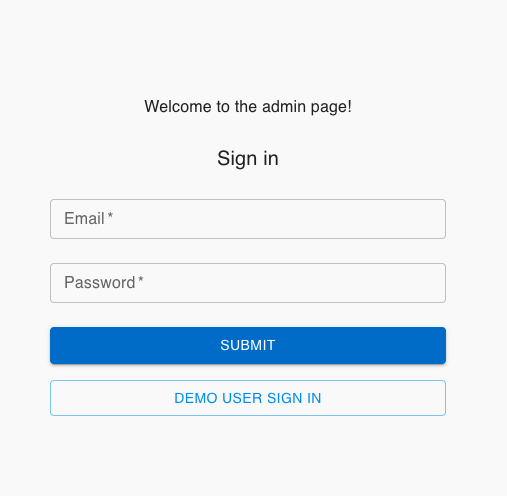
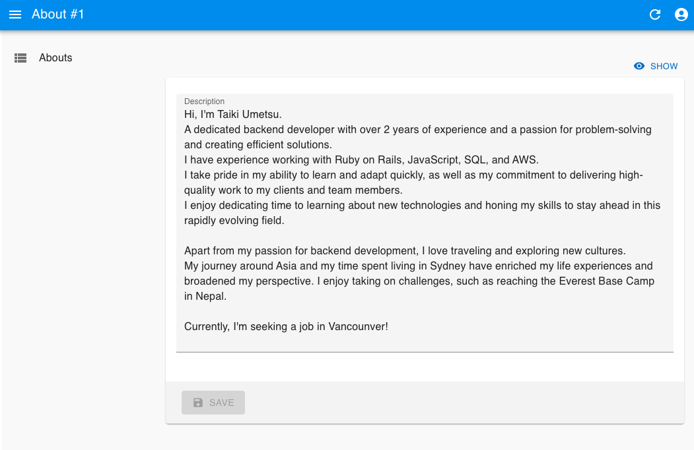
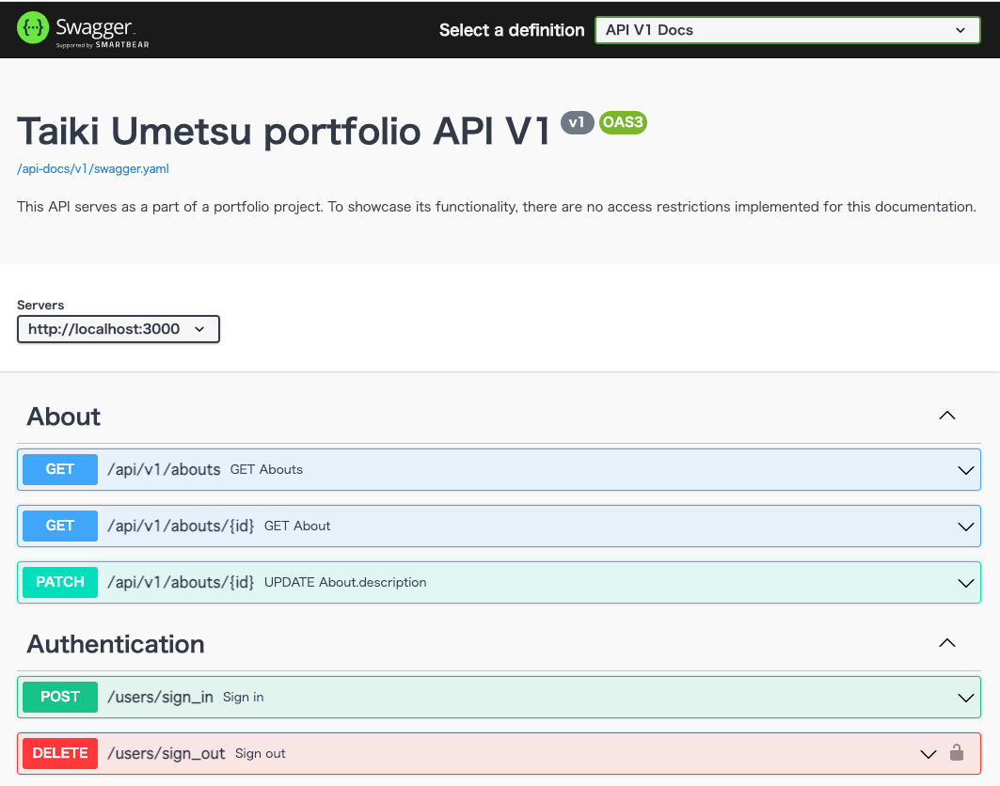

# Sign in

- providing a sign-in function for demo users as well.

# About page

# API server

- GitHub: https://github.com/taiki-umetsu/portfolio_api
- baseURL: https://portfolio-api.taikiumetsu.dev/
- API Document: https://portfolio-api.taikiumetsu.dev/api-docs/index.html  
  
