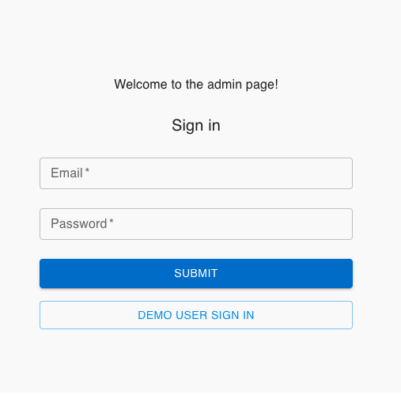
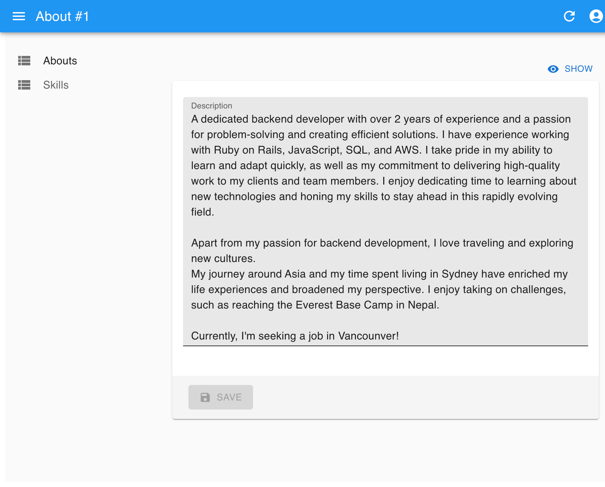
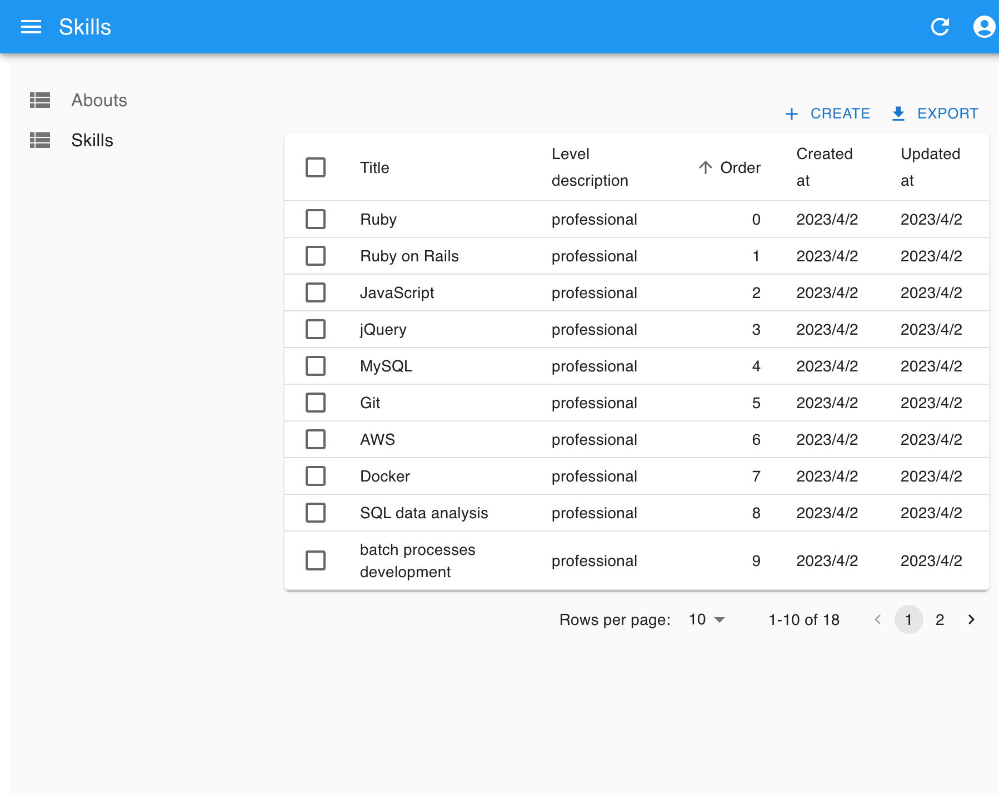
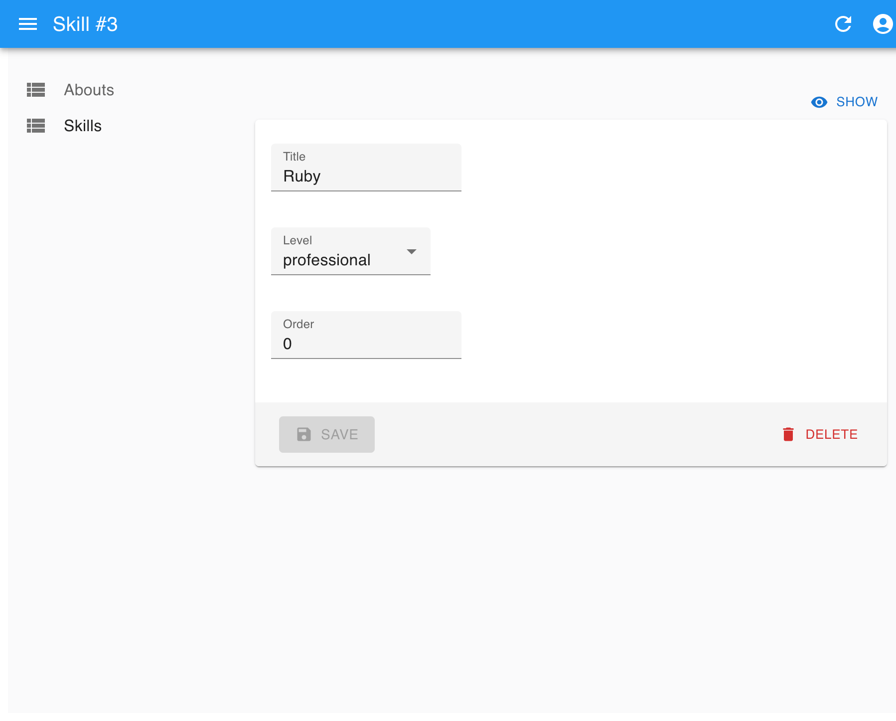
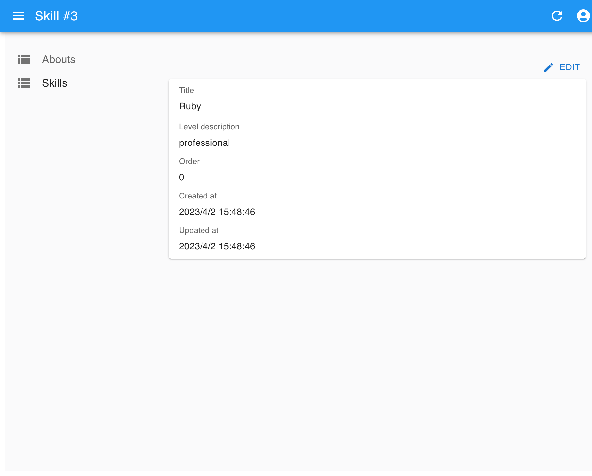

# My Portfolio Admin Panel

- Admin panel URL: https://portfolio-admin.taikiumetsu.dev/
- This project is an admin panel for [Taiki Umetsu portfolio](https://portfolio.taikiumetsu.dev/), built using the following technologies:

  - Typescript
  - Next.js
  - react-admin

# Sign in

 

- A sign-in function is available for demo users.
- The demo user has read-only access.
- Access control is managed by the backend server.

# Abouts page

 

# Skills page

 
 
 

# API server

- GitHub: https://github.com/taiki-umetsu/portfolio_api
- API Base URL: https://portfolio-api.taikiumetsu.dev/
- API Document: https://portfolio-api.taikiumetsu.dev/api-docs/index.html 
   

# Portfolio page

- Portfolio URL: https://portfolio.taikiumetsu.dev/
- GitHub: https://github.com/taiki-umetsu/portfolio-ui
